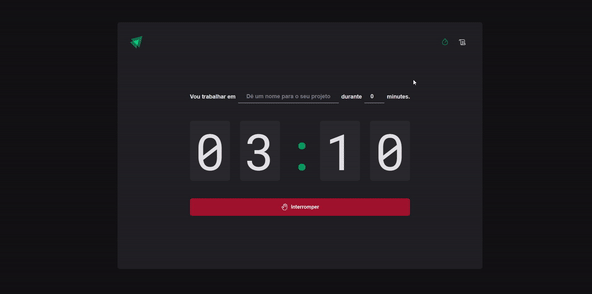

## Timer ignite

- Projeto desenvolvido durante o ignite de React da Rocketseat

## Tecnologias utilizadas
  - React
     - Context API, useReducer
  - Styled components
  - React hook form 
     - Zod ( to validate fields )

## Preview

